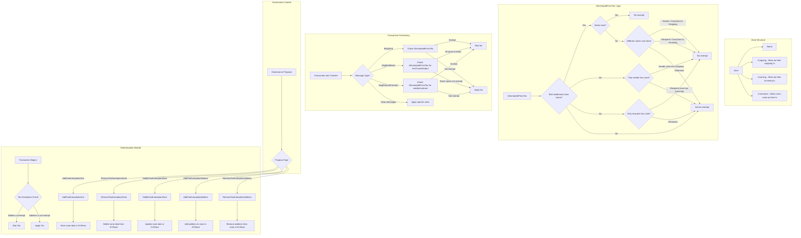

# x/taxexemption

## 🧾 Abstract

This document specifies the `taxexemption` module of the **LUNC ecosystem**.

The `taxexemption` module introduces a **community-controlled tax exemption (whitelist) system** that enables efficient and transparent management of tax-exempt addresses. It is designed to support specific use cases such as:

- Centralized Exchanges (CEXs) like Binance, CoinInn  
- Essential ecosystem operations (e.g., burn wallets)

The module provides both **flexibility** and **fairness** through a governance-driven design.

---

## 🧠 Tax Exemption Logic

A transaction is considered **exempt from tax** if it satisfies the **zone-based criteria** between the sender and all recipients.

### ✅ Rules for Tax Exemption:

#### 1. Neither Sender nor Recipients Belong to a Zone
- 🔒 **Not exempt**: All parties are unzoned — transaction is taxed.

#### 2. Sender and All Recipients Belong to the Same Zone
- 🔓 **Exempt**: Transaction remains within the same zone.

#### 3. Sender and Recipient Belong to Different Zones
- 🔓 **Exempt**, *if either of the following holds*:
  - Sender's zone has both `Outgoing = true` and `CrossZone = true`.
  - Recipient’s zone has both `Incoming = true` and `CrossZone = true`.
- 🔒 Otherwise, **not exempt**.

#### 4. Only Sender Has a Zone
- 🔓 **Exempt**, if sender’s zone has `Outgoing = true`.
- 🔒 Otherwise, **not exempt**.

#### 5. Only Recipient Has a Zone
- 🔓 **Exempt**, if recipient’s zone has `Incoming = true`.
- 🔒 Otherwise, **not exempt**.

> ⚠️ **Note**: All recipient addresses in a multi-recipient transaction must **individually satisfy exemption criteria** for the transaction to be exempt.

---

## 🛡️ Governance Enforcement

Tax exemption policies are governed **exclusively through on-chain governance** to ensure transparency and security.

### 🔒 Governance-Controlled Actions:

- ✅ Create a new tax exemption zone  
- 🔄 Update an existing zone’s properties (`Incoming`, `Outgoing`, `CrossZone`)  
- ❌ Delete an existing zone  
- ➕ Assign an address to a zone  
- ➖ Remove an address from a zone  

> ❗ **No user or smart contract** can modify tax exemption data outside of governance-approved proposals or whitelisted system authority.

---

## 🏗️ Architecture Diagram
This diagram illustrates the structure and flow of the TaxExemption module.


---

## 🔍 Core Concepts

### 1. **State**

Each **Zone** has the following properties:

| Property     | Type   | Description                                              |
|--------------|--------|----------------------------------------------------------|
| `Name`       | string | Unique identifier of the zone                           |
| `Incoming`   | bool   | Can receive tax-free transactions                       |
| `Outgoing`   | bool   | Can send tax-free transactions                          |
| `CrossZone`  | bool   | Allows tax-free transfers across zones                  |

---

### 2. **Stores**

The module uses two prefixed stores:

| Store Prefix               | Description                                     |
|---------------------------|-------------------------------------------------|
| `TaxExemptionZonePrefix`  | Stores zone definitions by zone name            |
| `TaxExemptionListPrefix`  | Maps addresses to their assigned zone           |

---

### 3. **Core Functions**

#### `AddTaxExemptionZone`
- Adds a new tax exemption zone to the KVStore under the zone name as the key.
- Each zone defines specific rules for tax exemption based on direction and cross-zone behavior.

#### `ModifyTaxExemptionZone`
- Updates the configuration of an existing tax exemption zone.
- Fails if the zone does not exist.

#### `RemoveTaxExemptionZone`
- Removes a tax exemption zone **and all associated addresses**.
- Cleans up:
  - The **Zone Registry**
  - The **Address Mapping**

#### `AddTaxExemptionAddress`
- Associates a Bech32-encoded address with a tax exemption zone.
- Ensures:
  - The zone exists.
  - The address is not already in a different zone.
  - If already in the same zone → no changes (idempotent behavior).

#### `RemoveTaxExemptionAddress`
- Removes an address from the tax exemption list only if:
  - It exists in the list.
  - It is associated with the specified zone.
- Prevents accidental disassociation from unrelated zones.

#### `IsExemptedFromTax`
- Determines whether a transaction between a sender and one or more recipients is exempt from tax.
- Checks:
  - Sender and recipient zone assignments.
  - Whether their zones allow **Incoming**, **Outgoing**, or **CrossZone** tax-exempt behavior.

---
# Tax Exemption Module - CLI Guide

A user can query and interact with the `taxexemption` module using the command-line interface (CLI).

---
The tax exemption module provides governance-controlled functionalities to manage tax-exempt zones and addresses. The process involves creating draft proposals, validating their format, and submitting them for governance approval.
----------------------------------------------------------------
Before submitting a proposal, users must create a draft proposal. Each proposal type has a specific msg type. Examples:

Add a tax-exempt zone: terra.taxexemption.v1.MsgAddTaxExemptionZone

Remove a tax-exempt zone: terra.taxexemption.v1.MsgRemoveTaxExemptionZone

Remove addresses from tax-exempt list: terra.taxexemption.v1.MsgRemoveTaxExemptionAddress

 Modify a tax exemption zone: terra.taxexemption.v1.MsgModifyTaxExemptionZone


The draft proposal creation command:
```bash
terrad tx gov draft-proposal
```
After creating a proposal, a JSON file will be generated that looks like the one below.

### Messages
```json
{
  "messages": [
    {
      "@type": "/terra.taxexemption.v1.MsgAddTaxExemptionZone",
      "zone": "bnb",
      "outgoing": false,
      "incoming": false,
      "cross_zone": false,
      "addresses": [
        "terra16r0fdcyy6whsfx9nxfx5zhhdwte59kaf3jm502"
      ],
      "authority": "terra10d07y265gmmuvt4z0w9aw880jnsr700juxf95n"
    }
  ],
  "metadata": "ipfs://CID",
  "deposit": "1000000uluna",
  "title": "add zone",
  "summary": "sum"
}
```
### Submit Proposal
```bash
terrad tx gov submit-proposal draft_proposal.json --from test0 --keyring-backend test --home mytestnet --fees 5665000uluna
```
---------------------------------------------------------------------------
## 📌 GetCmdQueryTaxable
This command allows users to check whether a transaction from a given sender address to a recipient address is exempt from tax, based on their zone assignment and zone rules.
### 🧾 Syntax

```bash
terrad query taxable [from-address] [to-address]
```

## 📌 GetCmdQueryZonelist
This command allows users to query and retrieve the list of all registered tax exemption zones
### 🧾 Syntax

```bash
simd query taxable zones
```

## 📌 GetCmdQueryExemptlist
This command allows users to query and retrieve all tax-exempt addresses associated with a specific zone.
### 🧾 Syntax

```bash
terrad query taxable addresses [zone-name]
```

