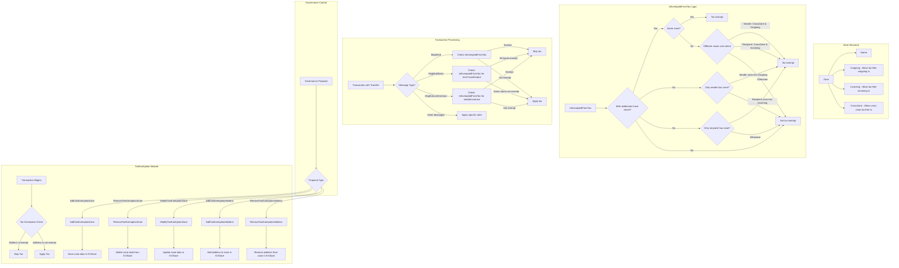

# TaxExemption Module Flowchart

This diagram illustrates the structure and flow of the TaxExemption module.

## TaxExemption Module Summary

The TaxExemption module enables specific addresses to be exempt from taxes in the blockchain network by organizing them into "zones" with configurable properties:

### Key Components

1. **Zone Structure**:
   - **Name**: Unique identifier for the zone
   - **Outgoing**: Allows tax-free transfers sent from addresses in this zone
   - **Incoming**: Allows tax-free transfers received by addresses in this zone
   - **CrossZone**: Allows tax-free transfers between different zones

2. **Core Functions**:
   - `AddTaxExemptionZone`: Creates a new zone with specific properties
   - `RemoveTaxExemptionZone`: Removes an existing zone
   - `ModifyTaxExemptionZone`: Updates properties of a zone
   - `AddTaxExemptionAddress`: Adds an address to a zone
   - `RemoveTaxExemptionAddress`: Removes an address from a zone
   - `IsExemptedFromTax`: Core logic that determines if a transaction is tax-exempt

3. **Tax Exemption Logic**:
   - The decision for tax exemption depends on whether the sender and recipient addresses belong to zones
   - Rules vary based on zone properties (outgoing, incoming, cross-zone)

4. **Governance Control**:
   - All zone and address modifications are controlled by governance
   - Only governance can add/remove/modify zones and addresses 